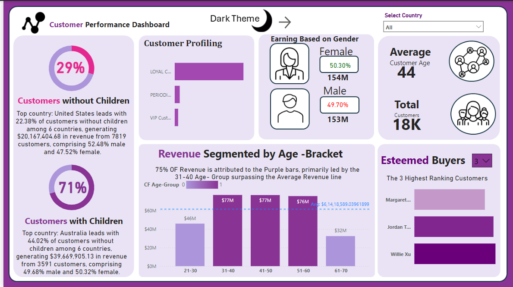
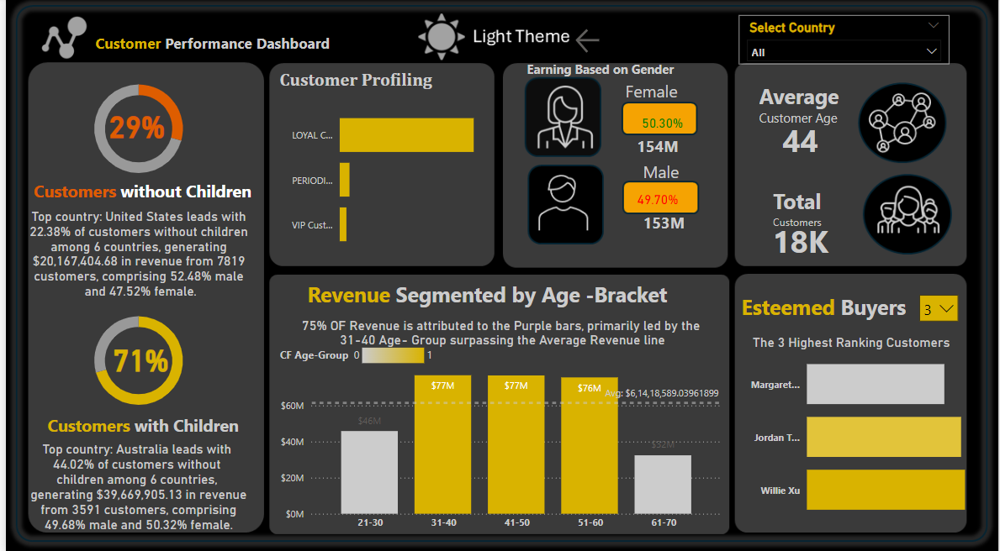

# Sales-data-Analysis
This Power BI dashboard analyzes sales data by segmenting customers based on age, gender, and purchasing behavior. It features dynamic filtering, advanced DAX calculations, and conditional formatting to highlight key metrics like total and average revenue. Interactive visuals help identify top customer segments for targeted business strategies.
It also provides dynamic filtering options to highlight the performance of top customer segments.

Key Features:
Data Loading & Transformation:
Data is imported and transformed via Power Query.
Essential columns such as customer age, product details, and sales territories are retained, while unnecessary columns are removed for a cleaner dataset.

Customer Segmentation:
Dynamic customer segmentation based on age categories and purchasing behavior.
A calculated measure for "Customer Age" and categorized groups (e.g., 0-10, 11-20) using the DateDiff() and SWITCH() functions.

Advanced Data Analysis:
Custom DAX measures such as AVERAGEX() are used to calculate average revenue per age group, providing a more granular look at revenue contributions.
Visuals include clustered column charts, line charts, and donut charts to display insights like total revenue per age group and gender distribution.

Conditional Formatting:
Conditional formatting is applied to visual elements using IF() logic to differentiate performance above and below average revenue. Custom color schemes, imported from external sources like PowerPoint, enhance readability.

Top Customer Analysis:
The report allows users to filter and view the top-performing customers by revenue using the RANKX function.
Drop-down filters enable viewing top entries dynamically, such as the "Top 5 Customers" or "Top 10 Customers."

Segmentation by Gender & Revenue Distribution:
Custom measures split revenue by gender and children status, providing demographic insights.
Visualization of the percentage of revenue contributed by male, female, and customers with/without children.

Interactive Dashboard:
Users can interact with visual filters to explore different dimensions of the data.
Reference lines, hover interactions, and sorting options make it easy to analyze trends and gain actionable insights.

Key DAX Functions Used:
AVERAGEX(): Calculates the average revenue per customer group.
IF(): Implements conditional logic for formatting and analysis.
CALCULATE(): Dynamically filters data for revenue calculations.
SUMX(): Aggregates data for specific filtered groups.
DIVIDE(): Calculates percentage contributions across different dimensions.

